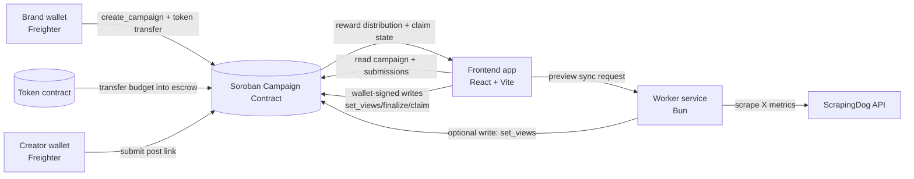

# Reachly

Reachly is a decentralized creator campaign platform on Stellar Soroban. Brands lock campaign budgets on-chain, creators submit X post links, views are synced, and rewards are distributed proportionally to contribution.


## Problem this project solves

Traditional influencer campaigns have three recurring trust problems:

- Budget custody risk: creators cannot verify that rewards are actually reserved.
- Opaque attribution: brands can dispute performance data or modify payout logic off-platform.
- Delayed or discretionary payouts: creators may wait for manual settlement.

Reachly solves this by combining:

- On-chain budget escrow through Soroban token transfers.
- Deterministic payout logic in a public smart contract.
- Creator self-serve claiming after finalization.

## Core model: pay per view

Reachly uses a proportional pay-per-view model. At finalization, each submission gets:

reward = (submission_views * total_budget) / total_views

Where:

- submission_views = views for one creator post
- total_budget = total campaign reward pool in token units
- total_views = sum of all recorded submission views

Behavioral notes:

- If there are no submissions, full budget is returned to the campaign brand.
- If submissions exist but all views are zero, finalization is rejected.
- Claims are creator-authorized and one-time only.

Contract reference:

- [stdcontract/contracts/hello-world/src/lib.rs](stdcontract/contracts/hello-world/src/lib.rs)

## Architecture diagram



## End-to-end flow

1. Brand creates campaign from the frontend with wallet signature.
2. Contract escrows campaign budget in token units.
3. Creators submit X links on-chain.
4. Worker scrapes view metrics for preview and/or sync.
5. Finalization writes views and locks per-submission rewards.
6. Creators claim rewards directly from contract.

## Repository structure

```text
Reachly/
├── .github/workflows/ci.yml   CI pipeline
├── client/                    React + Vite frontend
├── worker/                    Bun scraper + sync API
├── stdcontract/               Soroban contract workspace
└── todo.md                    active development notes
```

## File-by-file guide

### Root files

- [README.md](README.md): complete product and technical documentation.
- [todo.md](todo.md): in-progress implementation tasks.
- [.github/workflows/ci.yml](.github/workflows/ci.yml): GitHub Actions pipeline (frontend lint/build, worker install check, Rust tests).

### Frontend app

App shell and routing:

- [client/src/main.tsx](client/src/main.tsx): React bootstrap and provider wiring.
- [client/src/App.tsx](client/src/App.tsx): route map for Home, Dashboard, Campaign detail.
- [client/src/index.css](client/src/index.css): design tokens, shared styles, responsive behavior.
- [client/src/App.css](client/src/App.css): app-level layout styles.

Pages:

- [client/src/pages/Home.tsx](client/src/pages/Home.tsx): simplified marketing entry with navbar + hero CTA.
- [client/src/pages/Dashboard.tsx](client/src/pages/Dashboard.tsx): campaign browse/filter/create and wallet-aware creation flow.
- [client/src/pages/CampaignDetail.tsx](client/src/pages/CampaignDetail.tsx): submission management, sync preview, finalization, and claims.

Wallet and app providers:

- [client/src/web3/Providers.tsx](client/src/web3/Providers.tsx): wraps wallet provider + TanStack Query provider.
- [client/src/web3/stellarWallet.tsx](client/src/web3/stellarWallet.tsx): Freighter connect/refresh/disconnect, network checks, address state.

Data + chain integration:

- [client/src/lib/campaigns.ts](client/src/lib/campaigns.ts): Soroban client creation, query hooks, write transactions, retry/rate-limit helpers.
- [client/src/lib/stellarCampaign.ts](client/src/lib/stellarCampaign.ts): lightweight campaign count helper for hero UI.
- [client/src/types/index.ts](client/src/types/index.ts): domain types for Campaign and Submission.

Core UI components:

- [client/src/components/Navbar.tsx](client/src/components/Navbar.tsx): top nav with wallet connection state.
- [client/src/components/dashboard/CampaignCard.tsx](client/src/components/dashboard/CampaignCard.tsx): campaign summary cards.
- [client/src/components/dashboard/DashboardStats.tsx](client/src/components/dashboard/DashboardStats.tsx): dashboard stat blocks.
- [client/src/components/campaign/ActionBar.tsx](client/src/components/campaign/ActionBar.tsx): sync/finalize controls and helper messaging.
- [client/src/components/campaign/CampaignOverview.tsx](client/src/components/campaign/CampaignOverview.tsx): campaign metrics panel.
- [client/src/components/campaign/AddSubmissionForm.tsx](client/src/components/campaign/AddSubmissionForm.tsx): new post submission form.
- [client/src/components/campaign/SubmissionList.tsx](client/src/components/campaign/SubmissionList.tsx): responsive submissions table, mobile scroll wrapper, and totals.
- [client/src/components/campaign/SubmissionRow.tsx](client/src/components/campaign/SubmissionRow.tsx): per-submission claim controls.
- [client/src/components/hero/HeroSection.tsx](client/src/components/hero/HeroSection.tsx): hero copy, dynamic on-chain campaign counter, and CTA layout spacing.

UI primitives:

- [client/src/components/ui](client/src/components/ui): reusable primitive UI building blocks (inputs, dialogs, popovers, fields, etc.).

Generated contract bindings:

- [client/src/packages/hello_world/src/index.ts](client/src/packages/hello_world/src/index.ts): generated TypeScript contract client used by frontend and worker.

Frontend config files:

- [client/package.json](client/package.json): scripts and dependencies.
- [client/vite.config.ts](client/vite.config.ts): Vite setup.
- [client/eslint.config.js](client/eslint.config.js): lint rules.
- [client/tailwind.config.js](client/tailwind.config.js): Tailwind config.
- [client/vercel.json](client/vercel.json): deployment routing/build config.
- [client/.env.example](client/.env.example): required frontend environment variables.

### Worker service

- [worker/index.ts](worker/index.ts): Bun HTTP router and endpoint handlers.
- [worker/scraper.ts](worker/scraper.ts): tweet id parsing and ScrapingDog normalization.
- [worker/package.json](worker/package.json): worker scripts and dependencies.
- [worker/README.md](worker/README.md): worker setup and endpoint summary.

Worker endpoints:

- GET /health
- POST /scrape
- POST /scrape-batch
- POST /sync-campaign

### Smart contract workspace

- [stdcontract/Cargo.toml](stdcontract/Cargo.toml): Rust workspace manifest.
- [stdcontract/contracts/hello-world/Cargo.toml](stdcontract/contracts/hello-world/Cargo.toml): contract crate config.
- [stdcontract/contracts/hello-world/src/lib.rs](stdcontract/contracts/hello-world/src/lib.rs): campaign contract logic.
- [stdcontract/contracts/hello-world/src/test.rs](stdcontract/contracts/hello-world/src/test.rs): contract tests.
- [stdcontract/contracts/hello-world/Makefile](stdcontract/contracts/hello-world/Makefile): helper commands.
- [stdcontract/README.md](stdcontract/README.md): Soroban workspace notes.

## Contract method map

- create_campaign: brand-auth call, token escrow transfer, campaign initialization.
- submit: creator-auth call, appends submission if campaign active.
- set_views: writes submission views after deadline and before finalization.
- finalize_results: computes payout shares and locks reward data.
- claim_reward: creator-auth reward claim transfer.
- get_campaign_count/get_campaign/get_submission/get_submission_count: read APIs.


## CI/CD

Pipeline file:

- [.github/workflows/ci.yml](.github/workflows/ci.yml)

Current jobs:

- Frontend lint and build.
- Worker dependency install validation.
- Soroban contract tests.

## Local development

Frontend:

- cd client
- npm install
- npm run dev

Worker:

- cd worker
- bun install
- bun run dev

Contract:

- cd stdcontract/contracts/hello-world
- make build

Tests:

- cd stdcontract
- cargo test


## Tech stack

- Frontend: React, TypeScript, Vite, TanStack Query.
- Wallet: Freighter API, Stellar SDK.
- Worker: Bun, TypeScript.
- Contract: Soroban SDK (Rust).
- Social metric source: ScrapingDog X API.


## Mobile Responsive screenshots


## CI/CD


